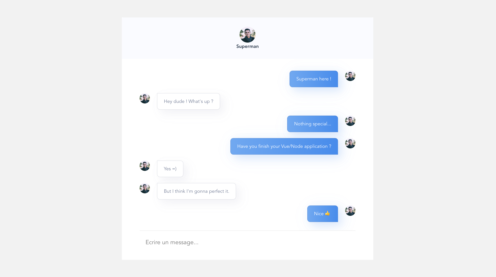

# inbenchat socket



## Before start

This is backend part, find my frontend in the following repository :
https://github.com/anthony-lopez-dev/inbenchat

## Project setup
```
yarn install
```

### Compiles and hot-reloads for development
```
yarn serve
```
